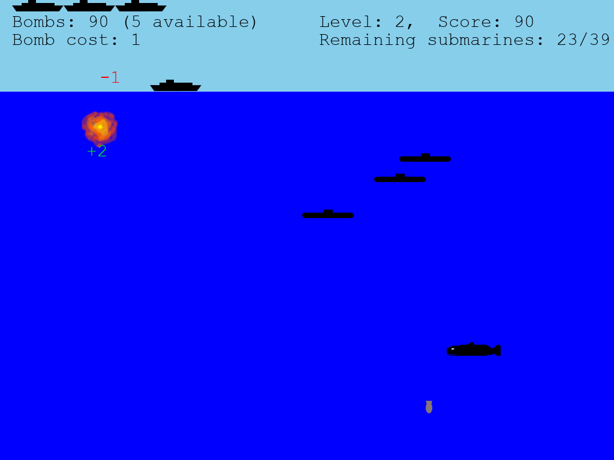

# U-Boot
A simple game



## Introduction

U-Boot is a simple game in which you gain score by destroying
submarines with bombs dropped from a ship. The game's title is
German for “submarine”. However, except fot the title, the game
is currently in English. But I eventually want to add
internationalization.

The main reason why I wrote this game is to gain familiarity
with Python.

## Installing the game

Make sure a sufficiently recent version of Python is installed
(3.8.10 or later) and in the executable search path (on Windows,
make sure the corresponding option is checked in the installer).

Get the U-Boot directory contents, either by locally cloning the
git repository, or by downloading and extracting the zip file
on github.

Open a terminal, go to the U-Boot directory, and type
```
python -m pip install --upgrade pip
pip install -r requirements.txt
```

You might need to use `python3` instead of `python`.

## Running the game

To play the game, make sure you've got a sufficient recent version
of Python and the required libraries installed (see previous section).
Then run `python uboot.py` (or possibly `python3 uboot.py`) in the
main directory. You may also be able to start the game from the GUI
by double clicking the file uboot.py.

## About the code

The game is implemented in Python using the library pygame.

See file dependencies.txt to see what Python and library versions
I've tested it. Later versions should probably work, too. Earlier
versions may or may not work. Note that some early 2.x versions
of pygame had broken mp3 support on Linux; this game won't run
unter Linux with those versions.

Note that I've tested this game onLinux Mint both with native Python
and under Wine; it should therefore run both under Linux and Windows.
I didn't test it on MacOS, but I expect it to work there as well.

This game uses some artwork files from others. All of them are either
public domain or under a Creative Commons license. Please see
the file non_original_files.txt for details.

## Caveats

As the game is still in development, the save file format may change
at any commit, invalidating earlier saved games.
